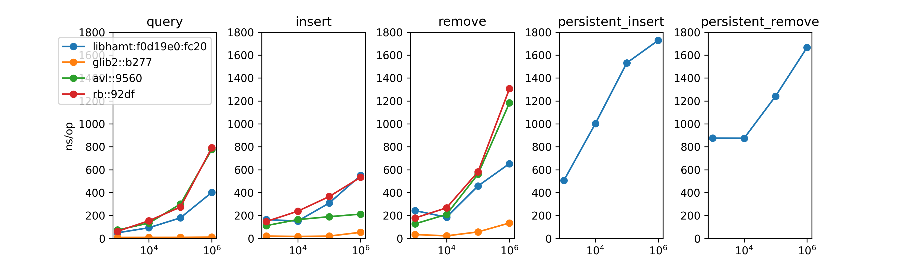

libhamt benchmarking tools
==========================



## Install

`hamt-bench` contains the `libhamt` sources as a git submodule.

### Setting up the repo

```bash
$ git clone --recursive https://github.com/mkirchner/hamt-bench
```

With older versions of git, make sure the submodule is complete:

```bash
$ git submodule update --init --recursive
```

### Setting up plotting

```bash
$ conda create -n hamt-bench python=3.9
$ conda activate hamt-bench
$ pip install -r requirements.txt
```

## Running benchmarks

```bash
$ make
$ ./bench.sh
$ python plot.py
```

## Implementation Notes

### SQLite database

The `bench.sh` script dumps benchmark results into an SQLite database under
`db/db.sqlite`, with a straightforward table schema and a simple analytics
view. This enables simple ad-hoc analyses, e.g.

```sql
sqlite> select * from summary_stats where measurement = 'query' and scale=100000;
gitcommit  benchmark                             measurement  scale   mean         stddev            min        max
---------  ------------------------------------  -----------  ------  -----------  ----------------  ---------  ---------
2d57697    5e11d462-e7db-4f21-9710-30fa7db548b2  query        100000  121.997183   383.976090230665  115.38517  131.55345
6a6a085    b08057d8-e9de-47d8-9559-2f6fa52bf38e  query        100000  76.895424    429.139423679528  66.26904   96.90809
843b6b7    1fde6f08-d727-446a-8247-781361321877  query        100000  101.4836555  404.609813299921  80.79365   122.65888
d34f0bb    06158ce2-b1bc-4cb9-9e0f-a0eaabcdf641  query        100000  63.6013935   442.425864885466  55.58964   82.92093
d34f0bb    65e373bf-665e-4058-8c57-5e673379303c  query        100000  64.050346    441.914024086331  57.26944   78.03136
d34f0bb    a6a6d414-f767-4263-a962-bd007139143a  query        100000  104.301223   401.673901154286  95.44441   114.01138
d34f0bb    e6673949-8613-463d-95cb-4a0a8ae61eb1  query        100000  92.154429    413.820533790206  85.50616   98.73488
```
